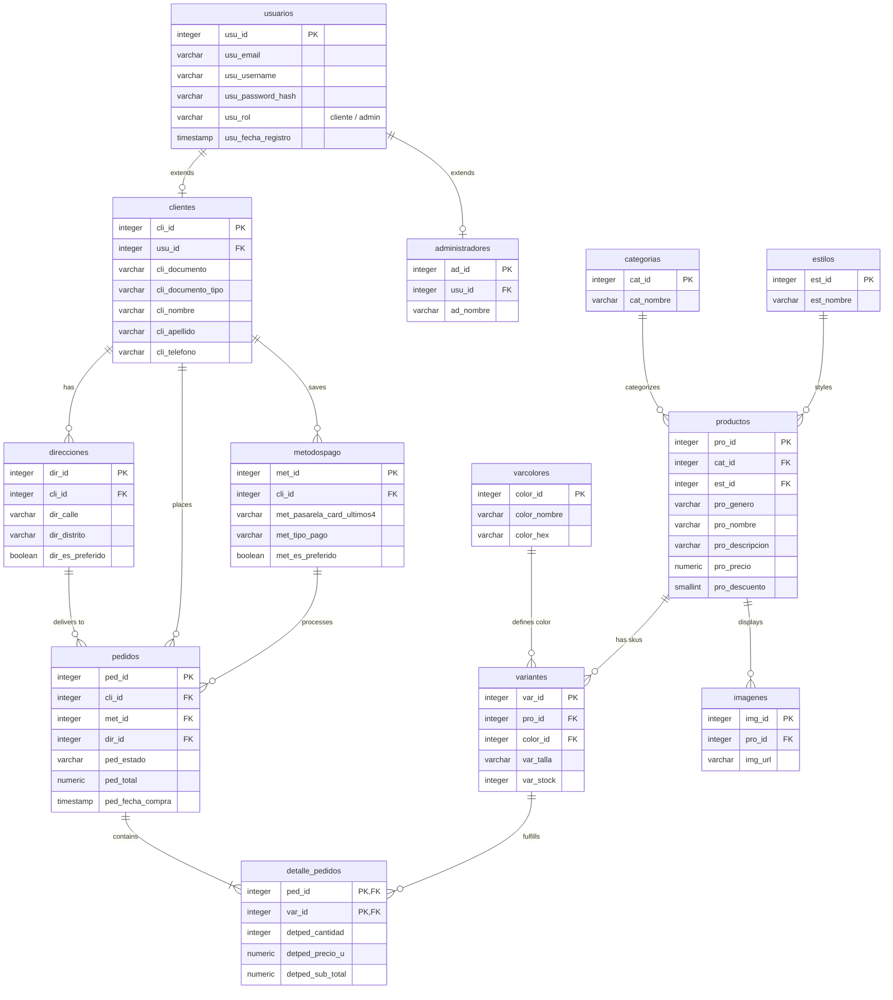

# Wayback Database Architecture

The PostgreSQL database for the Wayback platform is managed via the **Entity Framework Core Code-First** approach. The schema is highly normalized to ensure data integrity and is logically divided into four distinct domains.

## Entity-Relationship Schema

The following diagram illustrates the complete relational structure, including primary keys (PK), foreign keys (FK), and essential columns.

## Domain Breakdown

### 1. Identity & Access Domain
Handles authentication and role-based profiles.
- **usuarios:** Base table containing credentials and role logic.
- **clientes / administradores:** Extension tables containing role-specific profile data linked one-to-one with the base user table.

### 2. Catalog Domain
Organizes the core product offerings.
- **productos:** Core product definitions. Links to categories and styles.
- **categorias & estilos:** Lookup tables defining the taxonomy of the store for dynamic filtering.

### 3. Inventory Domain (SKUs)
Manages the physical stock variations.
- **variantes:** Represents the actual physical stock units (SKUs). Combines a specific product with a specific size and color, tracking exact inventory levels.
- **varcolores:** Global color palette definitions for consistency.
- **imagenes:** Product photography URLs stored externally linked directly to parent products.

### 4. Sales & Checkout Domain
Tracks the lifecycle of customer purchases.
- **pedidos (Orders):** Central record for financial transactions, linking clients to payment states, totals, and delivery destinations.
- **detalle_pedidos:** Line items mapping specific Variants, quantities, and historical prices to an Order.
- **direcciones:** Geolocation and physical address strings managed by clients.
- **metodospago:** Payment provider mappings.
